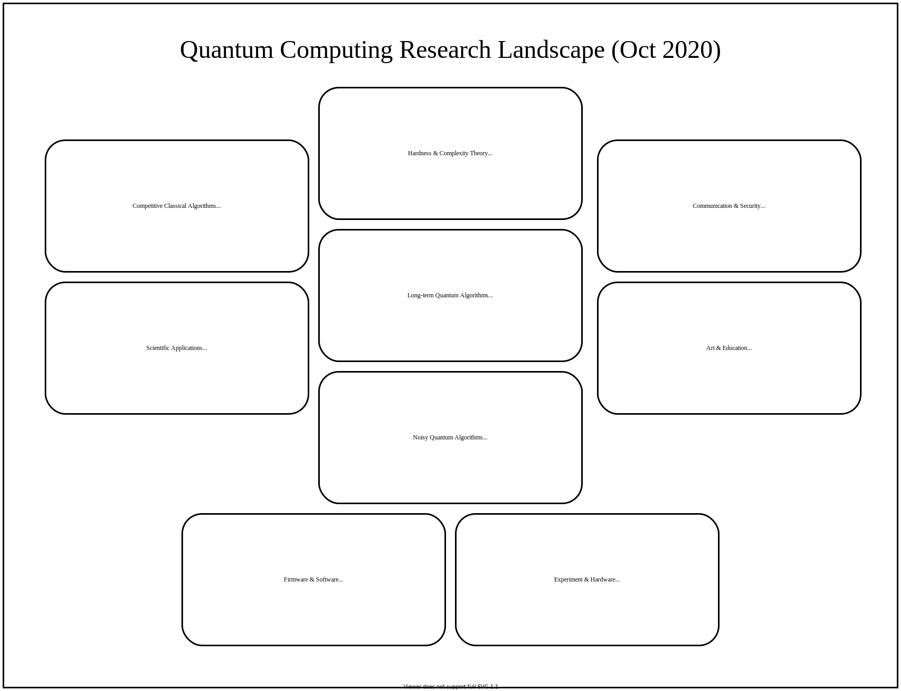

# Quantum Computing Research Landscape

To the best of my knowledge, this is "what's out there" in cutting-edge quantum computing research.

## Experiment & Hardware

## Firmware & Software

## NISQ Algorithms

## Physical Applications

## Long-term Quantum Algorithms

## Competitive Classical Algorithms

## Hardness & Complexity Theory

## Communication & Security

## Art & Education

---
Have any feedback? Please [add your comments on GitHub](https://github.com/marwahaha/qc-landscape/issues/new) or [email me](mailto:marwahaha@berkeley.edu).

I created the image above with [diagrams.net](https://www.diagrams.net/). You can view the image [in full-screen here](https://viewer.diagrams.net/#Uhttps%3A%2F%2Fraw.githubusercontent.com%2Fmarwahaha%2Fqc-landscape%2Fmain%2Fqcmap.svg). I make edits [at this link](https://app.diagrams.net/#Uhttps%3A%2F%2Fraw.githubusercontent.com%2Fmarwahaha%2Fqc-landscape%2Fmain%2Fqcmap.drawio).
